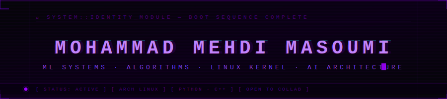

<div align="center">
  
</div>

<br/>

<div align="center">

```
╔─────────────────────────────────────────────────────────────────────╗
│  root@masoumi:~$ whoami                                             │
│  > Computer Engineering Student                                     │
│  > Machine Learning · Systems · Algorithm Design                    │
│  > Arch Linux  |  Python  |  C++                                    │
│  root@masoumi:~$ _                                                  │
╚─────────────────────────────────────────────────────────────────────╝
```

</div>

---


### `> SYSTEM LOG`

```bash
[ACTIVE]   studying      :: Computer Engineering
[ACTIVE]   building      :: ML systems from scratch
[ACTIVE]   learning      :: Deep learning architectures
[ACTIVE]   running       :: Arch Linux, btw
[FOCUS]    next target   :: Transformers & LLM fine-tuning
[MINDSET]  approach      :: Understand the system first
```

<br clear="right"/>

---

### `> STACK`

<div align="center">


</div>

---

### `> FOCUS VECTORS`

```
  ML / AI          →   Recommendation systems · Neural nets · Feature engineering
  SYSTEMS          →   OS internals · Memory models · Low-level C++
  ALGORITHMS       →   Graph theory · Dynamic programming · Complexity analysis
  SECURITY         →   Attack surfaces · Trust models · Adversarial thinking
```

---

### `> FEATURED PROJECT`

<div align="center">

[](https://github.com/mohammadmehdimasoumi/hybrid-movie-recommender)

</div>

```
┌──────────────────────────────────────────────────────────────────────┐
│  MODULE   :: Hybrid Movie Recommender                                │
│  TYPE     :: ML · Information Retrieval · Recommendation Engine      │
├──────────────────────────────────────────────────────────────────────┤
│                                                                      │
│  Combines collaborative filtering (Pearson correlation) with         │
│  content-based filtering (TF-IDF) into a weighted hybrid pipeline.   │
│  Ships with a live Streamlit interface for real-time inference.      │
│                                                                      │
│  STACK  ::  Python · scikit-learn · Pandas · NumPy · Streamlit       │
│  CORE   ::  Matrix factorization + TF-IDF embedding + hybrid scorer  │
│                                                                      │
└──────────────────────────────────────────────────────────────────────┘
```

---
<div align="center">
  
</div>

---

### `> ANALYTICS`

<div align="center">


</div>

<div align="center">
  
</div>

<div align="center">
  
</div>

---

<div align="center">

```
  "A system you don't understand is a system you can't control.
   I build from first principles — or I don't build at all."
```

</div>

---

<div align="center">

[](https://github.com/mohammadmehdimasoumi)
[](https://instagram.com/ctonm)

<br/>


<br/>


</div>
